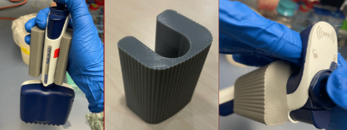
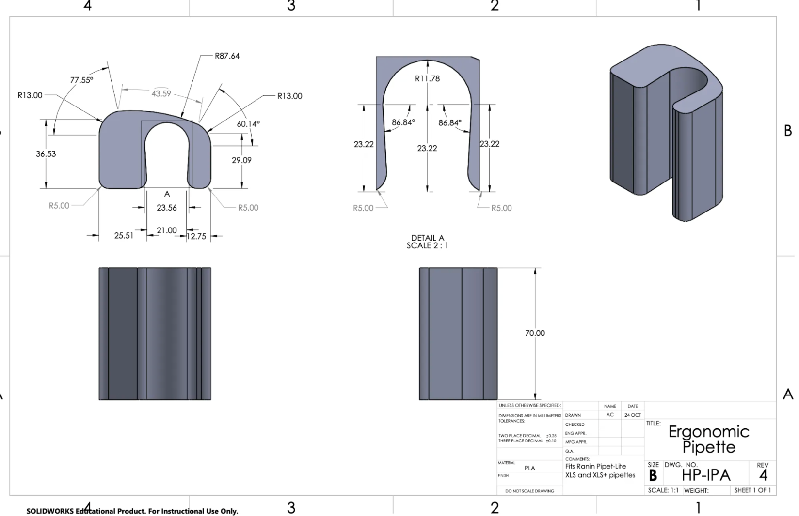
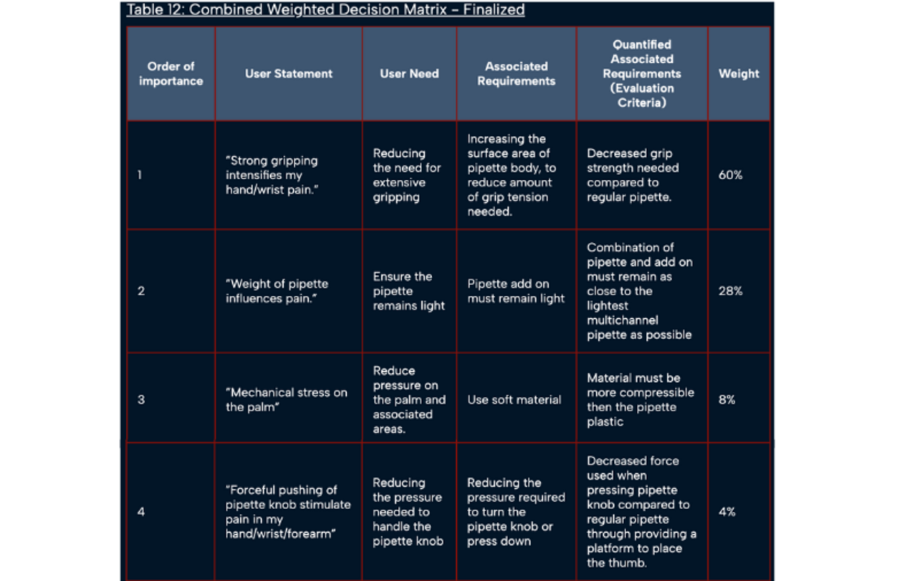

# micropipette-accessibility-tool
A universally compatible 3D printed add-on designed to reduce grip force and improve accessibility for wet lab users.
[See the entire project here!](https://2025.igem.wiki/ubc-vancouver/inclusivity/) Or see below for highlights.

## Problem
Standard micropipettes require repetitve motion and prolonged grip strength, limiting accessibility for users with motor impairments and musculoskeletal disorders.

## Approach
- Conducted stakeholder interviews with a user with limited wrist mobility
- Translated qualitative needs into design constraints
- Iterated through Solidworks and Onshape CAD prototypes, tailoring width and curvature
- Validated designs through user feedback

## Tools
SolidWorks · Onshape · 3D Printing · User Research · Notion · Figma

## Outcome

## Technical Drawing / CAD Model

## Weighted Decision Matrix

